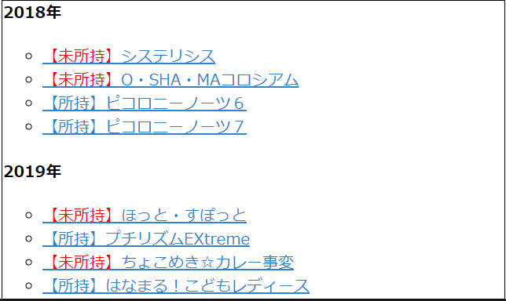
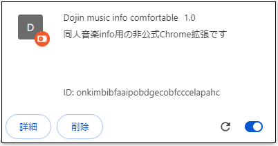

# 同人音楽info Comfortable
[同人音楽info](https://www.dojin-music.info/)用の非公式Chrome拡張です。

## 最新版

バージョン1.0（2024/10/6）

## 機能概要

### 未所持CD管理支援

同人音楽infoに所持CDを登録しておくと、サークルページやアーティストページから未所持のCDが分かるようになります。

## 使い方

### 所持CDを同人音楽info上に登録する（公式機能）

1. [同人音楽info](https://www.dojin-music.info/)にログインする
2. サイト内の検索ボックスから、登録したいCDを探す
3. 作品ページの下部で「持っているCDに追加」を押す

### 拡張機能内部の所持CDリストを更新する

同人音楽infoの[所持CDページ](https://www.dojin-music.info/my/possession)の右上の方にある「所持CDの更新」ボタンを押すと、拡張機能の内部ストレージ上に保持している所持CDリストが更新されます。

### 未所持CDを確認する
ログインして所持CDを更新した状態でアーティストページ、サークルページ、タグページなどを開くと、所持未所持が一覧で分かるようになっています。

## 手動での導入方法

本拡張機能はChrome Web Store申請中ですが、すぐに使いたい場合、手動で導入することもできます。

### 導入方法

1. このページの右上のCode>Download ZIPでダウンロードし、解凍して好きなところに置く
2. ググる（例：[自作したchrome拡張機能のインストール方法](https://exemate.co.jp/archives/7594)）

### 更新方法

1. [chrome://extensions/](chrome://extensions/)で「Dojin music info comfortable」を探す
2. 導入方法と同様にフォルダをダウンロードする
3. 古いフォルダを新しいフォルダで丸ごと置き換える。
4. 上の画像の更新できそうな矢印（↻）を押す。

### アンインストール方法

1. [chrome://extensions/](chrome://extensions/)から「Dojin music info comfortable」を探して「削除」する
2. 「dojin-music-info-comfortable」をダウンロードしたフォルダを削除する

## 更新履歴

### バージョン1.0（2024/10/6）
作成。「未所持CD管理支援」を公開。

## 問い合わせ先

https://x.com/BinomialSheep

本拡張機能に関して何か不具合などあれば公式ではなく本開発者に問い合わせください。  
原因が拡張機能か分からない場合もこちらでお願いします。
